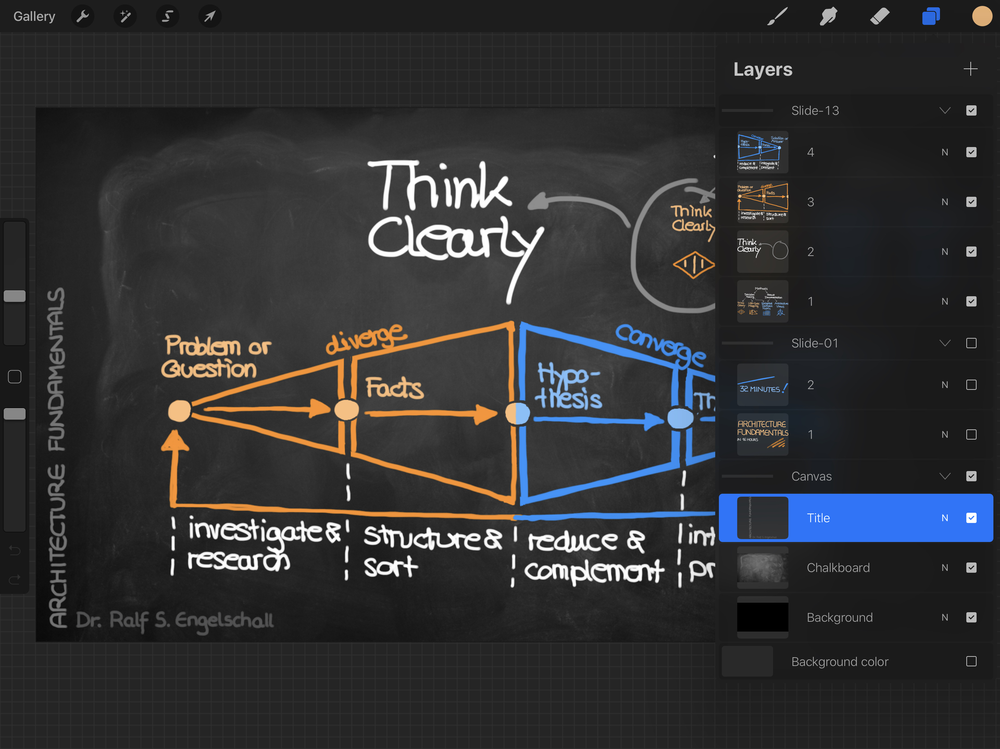
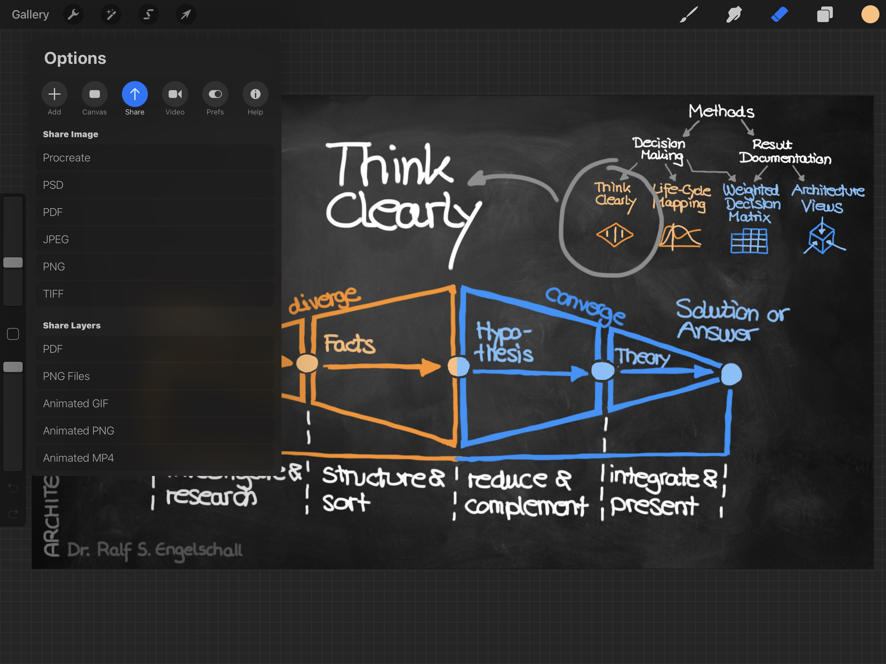
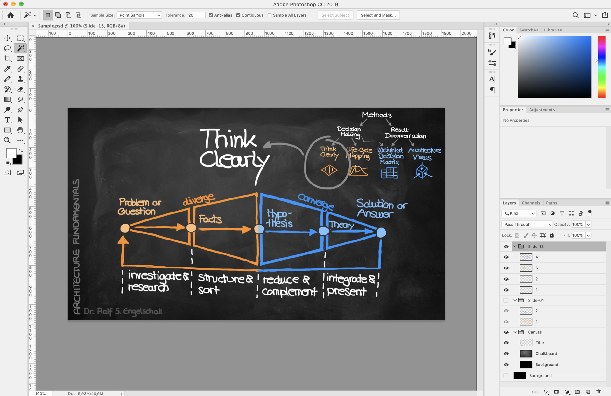
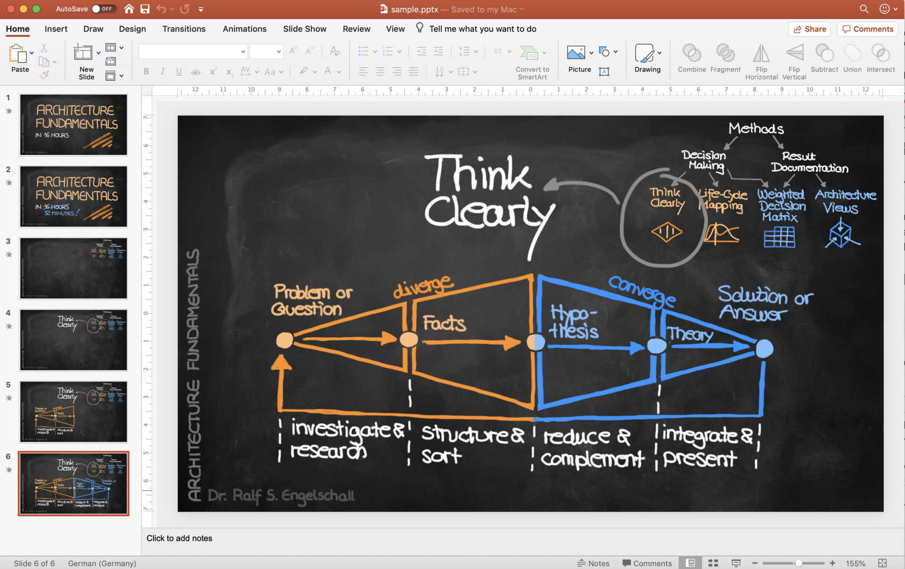

psd2pptx
========

**Convert Photoshop (PSD) layers to PowerPoint (PPTX) slides**

<p/>


<p/>


Abstract
--------

This is a small Node utility for converting the layers of a Photoshop
(PSD) graphics file into slides of a PowerPoint (PPTX) presentation. The
intention is to hand-draw the slides as individual transparent layers in
an application like Procreate (on the iPad) and convert the layers into
flattened slides for regular presentation via PowerPoint.

Installation
------------

```
$ npm install -g psd2pptx
```

Usage
-----

1. Create an image in your preferred graphics program (e.g. Procreate on iPad)
   with the usual screen-dimensions like 1920x1080. Create a group
   named `Canvas` (or what you later specify as option `-c`/`--canvas`)
   and create your background canvas there with an opaque bottom layer
   and zero or more transparent stacked layers. Create your slides by
   creating a group for each slide and an transparent bottom layer and
   zero or more additional transparent stacked layers.

   

2. Export the image in Photoshop (PSD) format and copy it to your desktop computer.
   In Procreate *Options* &rarr; *Share* &rarr; *Share Image* &rarr; *PSD*
   and share it to your desktop computer via *AirDrop* or any cloud storage provider.

   

3. Optionally check the resulting PSD file in Photoshop.

   

4. Convert the received Photoshop (PSD) file to a corresponding PowerPoint (PPTX) file.

    ```shell
    $ psd2pptx -v -o sample.pptx sample.psd
    ++ reading PSD file: sample.psd
    ++ extracting layer: Slide-13/4
    ++ extracting layer: Slide-13/3
    ++ extracting layer: Slide-13/2
    ++ extracting layer: Slide-13/1
    ++ extracting layer: Slide-01/2
    ++ extracting layer: Slide-01/1
    ++ extracting layer: Canvas/Title
    ++ extracting layer: Canvas/Chalkboard
    ++ extracting layer: Canvas/Background
    ++ generating canvas: Canvas/Title, Canvas/Chalkboard, Canvas/Background (1920x1080)
    ++ generating image: Slide-01/1 (scratch)
    ++ generating image: Slide-01/2 (merged)
    ++ generating image: Slide-13/1 (scratch)
    ++ generating image: Slide-13/2 (merged)
    ++ generating image: Slide-13/3 (merged)
    ++ generating image: Slide-13/4 (merged)
    ++ generating slide: Slide-01/1
    ++ generating slide: Slide-01/2
    ++ generating slide: Slide-13/1
    ++ generating slide: Slide-13/2
    ++ generating slide: Slide-13/3
    ++ generating slide: Slide-13/4
    ++ generating PPTX
    ++ post-adjusting PPTX
    ++ writing PPTX file: sample.pptx
    ```

5. Use the resulting PPTX file in PowerPoint.
   
   

License
-------

Copyright (c) 2019-2020 Dr. Ralf S. Engelschall (http://engelschall.com/)

Permission is hereby granted, free of charge, to any person obtaining
a copy of this software and associated documentation files (the
"Software"), to deal in the Software without restriction, including
without limitation the rights to use, copy, modify, merge, publish,
distribute, sublicense, and/or sell copies of the Software, and to
permit persons to whom the Software is furnished to do so, subject to
the following conditions:

The above copyright notice and this permission notice shall be included
in all copies or substantial portions of the Software.

THE SOFTWARE IS PROVIDED "AS IS", WITHOUT WARRANTY OF ANY KIND,
EXPRESS OR IMPLIED, INCLUDING BUT NOT LIMITED TO THE WARRANTIES OF
MERCHANTABILITY, FITNESS FOR A PARTICULAR PURPOSE AND NONINFRINGEMENT.
IN NO EVENT SHALL THE AUTHORS OR COPYRIGHT HOLDERS BE LIABLE FOR ANY
CLAIM, DAMAGES OR OTHER LIABILITY, WHETHER IN AN ACTION OF CONTRACT,
TORT OR OTHERWISE, ARISING FROM, OUT OF OR IN CONNECTION WITH THE
SOFTWARE OR THE USE OR OTHER DEALINGS IN THE SOFTWARE.

